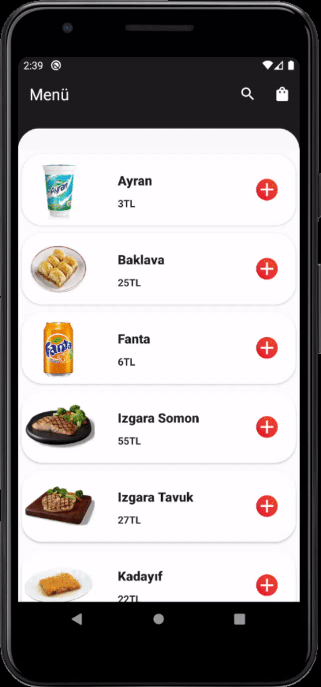

# Food Ordering App

A simple food ordering app created for Turkcell Android Bootcamp finishing project. This project includes technologies like Retrofit, RoomDB, LiveData, Data binding, Coroutines and MVVM architecture has been used.

There are 3 main pages, one for menu, one for detailed page for the foods and drinks and lastly one for the cart.

## Demo

